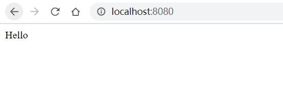
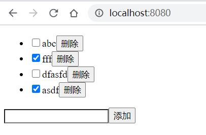
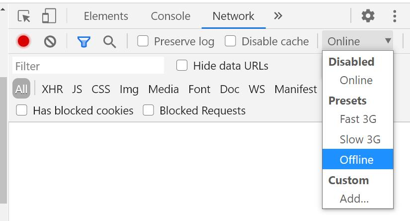

# webpack-pwa-tutorial
基于webpack只做PWA的例程

## 场景定义： todo list
一个支持离线的 todo list，感兴趣的同学可以补充下云端同步的功能。

## 步骤

### 初始化 React+webpack

安装依赖
```
npm init -y
npm i react react-dom webpack babel-loader @babel/core @babel/preset-react @babel/preset-env html-webpack-plugin webpack-cli webpack-dev-server -D
```

package.json 配置启动脚本
```
{
  ...
  "scripts": {
    "dev": "webpack serve --mode=development",
```

src/index.js 首页
```
import React from 'react'
import ReactDOM from 'react-dom'

let dom = document.createElement("div")
document.body.appendChild(dom)

ReactDOM.render(
  <div>Hello</div>,
  dom
)
```

webpack.config.js 配置webpack
```
const { join } = require('path')
const HtmlWebpackPlugin = require('html-webpack-plugin')

module.exports = {
  entry: './src/index.js',
  output: {
    path: join(__dirname, 'dist')
  },
  module: {
    rules: [
      {
        test: /\.m?js$/,
        exclude: /node_modules/,
        use: {
          loader: 'babel-loader',
          options: {
            presets: [
              '@babel/preset-env',
              '@babel/preset-react',
            ]
          }
        }
      }
    ]
  },
  plugins: [new HtmlWebpackPlugin()]
}
```

启动一下
```
npm run dev
```




### 开发 todo list

这里本地数据存储选择了 indexedDB

增加依赖
```
npm i dexie -D
```
src/ToDo.js todo组件
```
import React, { useEffect, useRef, useState } from 'react'
import { loadTodos, addTodo, updateTodo, removeTodo } from './db'

const ToDo = () => {
  let [todos, setTodos] = useState(undefined)
  let [version, setVersion] = useState(0)
  let [title, setTitle] = useState('')
  let input = useRef()
  useEffect(() => {
    loadTodos().then(todos => setTodos(todos))
  }, [version])
  if (todos === undefined) return <div>loading...</div>
  return <div>
    {todos.length
      ? <ul>{todos.map(({ id, title, done }) => <li key={id}>
        <input type="checkbox" checked={done} onChange={e => {
          updateTodo(id, { done: !done }).then(setVersion(x => x + 1))
        }} />
        {title}
        <button onClick={e => {
          removeTodo(id).then(setVersion(x => x + 1))
        }}>删除</button>
      </li>)}</ul>
      : <p>尚无记录</p>}
    <input ref={input} value={title} onChange={e => setTitle(e.target.value)} />
    <button onClick={() => {
      if (!title) {
        let el = input.current
        el.style.transition = 'none'
        el.style.backgroundColor = 'red'
        setTimeout(() => {
          el.style.transition = 'background-color 2s'
          el.style.backgroundColor = 'transparent'
        })
        return
      }
      addTodo({ title, done: false }).then(() => {
        setVersion(x => x + 1)
        setTitle('')
      })
    }}>添加</button>
  </div>
}

export default ToDo
```
数据操作
```
import Dexie from 'dexie'

export const db = new Dexie("TodoDatabase");
db.version(1).stores({
  todos: "++id,title,done"
})

export function loadTodos() {
  return db.todos.toArray()
}

export function addTodo(todo) {
  return db.todos.add(todo)
}

export function removeTodo(id) {
  return db.todos.where({ id }).delete()
}

export function updateTodo(id, changes) {
  return db.todos.where({ id }).modify(changes)
}
```

index.js 更新入口
```
import React from 'react'
import ReactDOM from 'react-dom'
import ToDo from './ToDo'

let dom = document.createElement("div")
document.body.appendChild(dom)

ReactDOM.render(
  <ToDo />,
  dom
)
```

在启动体验下
```
npm run dev
```


### 让 todo list 离线可用

安装 workbox 依赖
```
npm i workbox-webpack-plugin -D
```

webpack.config.js 使用 workbox 产生 service worker 插件
```
const { GenerateSW } = require('workbox-webpack-plugin')
...
  plugins: [
    ...
    new GenerateSW()
  ]
}
```

src/index.js 追加使用产生的 service worker 
```
...
if ('serviceWorker' in navigator) {
  window.addEventListener('load', () => {
    navigator.serviceWorker.register('/service-worker.js').then(registration => {
      console.log('SW registered: ', registration);
    }).catch(registrationError => {
      console.log('SW registration failed: ', registrationError);
    });
  });
}
```

到此基本的离线可用已经实现，验证步骤如下
- 构建产线版本：yarn webpack build --production
- http服务：http-server dist
- 打开浏览器访问 localhost:8080 稍微等待一下（service worker 安装）
- 可选，操作一下，加点数据
- 关闭窗口并另打开一个窗口，F12 打开 debugbar->network 其中 online 选为 offline 这表示离线了，再打开 http://localhost:8080/ 是可以打开的


